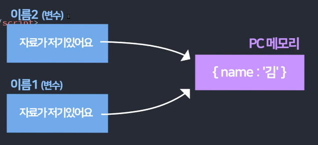

# apple_JS_ES6
> 매우쉽게 이해하는 JavaScript 객체지향 & ES6 신문법

<br>

***

<br>

## level1_1: 강의 듣기 전 자바스크립트 기본 문법 총정리 (복기하기)
* object 불러오기
> ['age']와 .age는 같다
```javascript
var name = {name: 'kim', age: 20}
name['age']
name.age
```

<br>

***

<br>

## level1_2: this 키워드를 알아보자 1. 함수와 Object에서 사용하면?
- **window**는 모든 전역변수, 함수, DOM을 보관하고 관리하는 전역객체(global object)
- **메소드**는 오브젝트안의 함수
- **strict mode?** 최상단에 'use strict' (E10 ↑)를 쓰면 JS를 엄격하게 제어

<br>

### 1. 그냥 쓰거나 함수 안에서 쓰면 this는 window를 뜻한다
- 그냥 쓸 때
```javascript
console.log(this) //window{} 
```

<br>

- 함수 안에서 쓸 때
```javascript
function 간지나는함수(){
console.log(this)
}

간지나는함수(); //window{}
```

<br>

### 1-2. strict mode일 때 함수 안에서 쓰면 this는 undefined
- strict mode에선 var 키워드 없이 변수를 선언하거나, 변수를 arguments라는 이상한 키워드로 선언하거나 그런 실수를 방지해줌

<br>

### 2. object에 있는 함수안의 this는 그 메소드의 주인을 뜻함
```javascript
var 오브젝트1 = {
  data : 'Kim',
  간지함수 : function(){ console.log(this) } 
}

오브젝트1.간지함수(); //{ data : 'Kim', 간지함수 : f } 
```

<br>

### 결론
- 메소드안의 this는 메소드의 주인 오브젝트를 뜻한다 
- 일반함수는 window라는 오브젝트에 자동으로 추가가 되기 때문에 this는 일반함수의 주인 오브젝트인 window를 뜻함 
- 오브젝트1 > 오브젝트2의 this는 오브젝트1
- 오브젝트1 > 오브젝트2 > 오브젝트3의 this는 오브젝트2

<br>

***

<br>

## level1_3: this 키워드를 알아보자 2. event listener와 constructor
- **constructor문법?** 오브젝트를 비슷한걸 여러개 만들고 싶을 경우에 사용
- **instance**는 constructor에서 새로 생성된 오브젝트를 뜻함
- 일반 함수문법에서 메소드안의 콜백함수의 this는 window를 뜻함
- arrow문법에서는 위에 있는 this값을 물려받음

<br>

### 3. constructor안의 this는 새로생성되는 오브젝트를 뜻한다
```javascript
function 기계(){
    this.이름 = 'Kim';
    this.나이 = 20;
}

// 꺼낼 땐?
var 오브젝트 = new 기계();
console.log(오브젝트)
```

<br>

### 4. eventlistener안의 this는 e.currentTarget이라는 의미
```javascript
document.getElementById('btn').addEventListener('click', function(e){
    console.log(this) //<button id="btn">버튼</button>
    console.log(e.currentTarget) //<button id="btn">버튼</button>
});
```

<br>

### case1. 이벤트리스너 안에서 콜백함수를 쓴다면 this는 window
```javascript
document.getElementById('btn').addEventListener('click', function(e){
    [1,2,3].forEach(function(){
    console.log(this) //window{}
  });
});
```

<br>

### case2. 오브젝트 안에서 콜백함수를 쓴다면 this는 window
- *이것 좀 헷갈림*
- forEach에 앞의 요소는 object가 아니다

<br>

```javascript
var 오브젝트 = {
  이름들 : ['김', '이', '박'];
  함수 : function(){
      오브젝트.이름들.forEach(function(){
        console.log(this) //window{}
      });
  }
}
```

<br>

### case3. arrow function 문법과 this
> arrow에서는 위에 있는 this값을 물려받음

<br>

1. 기존 function
```javascript
var 오브젝트 = {
  이름들 : ['김', '이', '박'];
  함수 : function(){
      console.log(this) //오브젝트
      오브젝트.이름들.forEach(function(){
        console.log(this) //window{}
      });
  }
}
```

<br>

2. arrow function
```javascript
var 오브젝트 = {
  이름들 : ['김', '이', '박'];
  함수 : function(){
      console.log(this) //오브젝트
      오브젝트.이름들.forEach(() => {
        console.log(this) //오브젝트
      });
  }
}
```

<br>

***

<br>

## level1_4: Arrow function은 function을 대체하는 신문법이 아님
-


### arrow function 기본문법
```javascript
// 기존문법
var 예쁜함수 = function(){}

// arrow문법
var 예쁜함수 = () => {}
```

<br>

### 장점? 함수 본연의 기능을 잘 표현해줌
- 함수만드는 이유는 기능으로 묶고 싶을 떼,입출력기계를 만들고 싶을때 등
- arrow는 함수 본연의 입출력기능을 아주 직관적으로 잘 표현해줌
- 입출력기능? 소괄호에 뭔가 집어넣으면 return을 이용해 뭔가 뱉어내는 것

```javascript
// 기존문법
var 더하기 = function(x){ return x + 2 }

// arrow문법
var 더하기 = (x) => { return x + 2}
```

<br>

-파라미터 1개면 소괄호 생략가능
```javascript
var 더하기 = x => { return x + 2}
```

<br>

-코드 1줄이면 중왈호도 생략가능
```javascript
var 더하기 = x => return x + 2
```
> 원래 {} 중괄호 끝날 땐 세미콜론 안쳐도 잘 되는데 생략할 땐 매너있게 세미콜론 적자  

<br>

### arrow의 this는 밖에 있던 this값을 그대로 사용
- 이벤트리스너에 this값은 window를 뜻함, e.currentTarget을 뜻하지 X

<br>

- object안의 arrow함수에서 this는 window 
```javascript
// 기존문법
var 오브젝트1 = {
  함수 : function(){ console.log(this) }
}
오브젝트1.함수() //오브젝트1


// arrow문법
var 오브젝트1 = {
  함수 : () => { console.log(this) }
}
오브젝트1.함수() //window{}
```

<br>

### 결론
arrow문법은..
- eventListener에서 this는 window
- 오브젝트안의 함수에서 this는 window
- arrow의 this는 위에 있는 this값을 물려받음

<br>

***

<br>

## level1_5: this & arrow function 연습문제 3개
### Q1. 메소드와 형제 요소로 자료출력
```javascript
var 사람 = {
    name: '손흥민',
    sayHi: (a) => {
        return `안녕 나는 ${a}`
    }
}
console.log(사람.sayHi(사람.name));
```

<br>

### Q2. 메소드로 형제 요소 모두 더하기
- 자료.data: 메소드에서 형제 자료를 가져다 쓸 때는 오브젝트명을 명시해야함 
```javascript
var 자료 = {
    data: [1, 2, 3, 4, 5],
    전부더하기: () => {
        let sum = 0;
        자료.data.forEach((a) => {
            sum += a
        })
        return sum;
    }
}
console.log(자료.전부더하기());
```

<br>

### Q3. 버튼 안의 글자 1초후에 출력하기
- 기존문법: 이벤트리스너안의 콜백함수에서 this는 window를 뜻함
- arrow문법: 이벤트리스너안의 콜백함수에서 this는 밖에 있는 this값을 물려받음

<br>

```javascript
document.getElementById('버튼').addEventListener('click', function() {
    console.log(this)
    setTimeout(() => { //기존문법 this쓰면 오류
        console.log(this.innerHTML)
    }, 2000)
});
```

<br>

***

<br>

## level1_6: 변수 신문법 총정리 1. var let const와 선언,할당,범위
- var 재선언O, 재할당O, 범위 function
- let 재선언O, 재할당X, 범위 {}
- const 재선언X, 재할당X, 범위 {}
- const로 오브젝트값 변경하는 건 에러X (할당이 아님)
- 대신 Object.freeze 쓰면 변경 못하는 오브젝트 만들 수 있음

<br>

### 재선언
```javascript
var 이름 = 'Kim'
var 이름 = 'Park'
```

<br>

### 재할당
```javascript
var 이름 = 'Kim'
이름 = 'P
ark'
```

<br>

### 범위
```javascript
function 함수() {
    var 이름1 = 'kim' //var는 function  
}
```

<br>

***

<br>

## level1_7: 변수 신문법 총정리 2. Hoisting, 전역변수, 참조

<br>

### Hoisting
- 변수의 선언을 맨위로 끌고오는 현상
- 함수도 호이스팅 현상이 일어남

```javascript
// 자바스크립트 입장에서는 
// var 나이가 이미 선언된 상태

console.log(나이); //undefined (선언은 됐지만 할당은 안된 상태)

var 나이 = 30;

console.log(나이); // 30
```

<br>

### 전역변수
- 제일 바깥에 선언한, 모든 곳에서 쓸 수 있는 변수
- window로 전역변수를 만들 수도 있음 (window.이름 = '김') ==> better👍
- 지역변수? 함수 안에 선언한 변수

<br>

### 연습문제
```javascript
if(true) {
    let a = 1;
    var b = 2;

    if (true) {
        let b = 3;
    }

    console.log(b); // 2
    // let범위는 {}니까 3이 아님
}
```

<br>

***

<br>

## level1_8: 변수 연습문제

<br>

### 1. let은 호이스팅되지만 undefined을 할당해주지 않는다 (initialization)
- 그래서 엄격하게 쓸 수있는 let, const를 사용하는 것임
```javascript
테스트(); // 함수 호이스팅 때문에 출력가능
function 테스트() {
    console.log(안녕)
    var 안녕1 = 'Hello!' // undefined
    let 안녕2 = 'Hello!' // 에러 
}
```

<br>

### 2. 변수에 할당하는 방법으로 함수를 만들면 변수 선언만 호이스팅 된다.
- 때문에 함수()는 변수에 소괄호를 붙인 형식으로 에러가 남
```javascript
함수();
var 함수 = function() {
  console.log(안녕);
  var 안녕 = 'Hello!';
} 
```

<br>

### 3. let은 호이스팅되지만 undefined을 할당해주지 않는다 (initialization)
```javascript
```

<br>

### 2. let은 호이스팅되지만 undefined을 할당해주지 않는다 (initialization)
```javascript
```

<br>

***

<br>

## level1_9: 자바스크립트가 문자 다루는 신기한 방법 (Template literals)

### backtick(backquote)의 장점
- 엔터키 가능
- 중간에 ${변수} 넣기 쉬움
- 함수와 같이 사용 (tagged literal)

<br>

### tagged literal
- 백틱 문장의 문자는 array로 만들어주고, 변수는 그대로 출력해줌
- 파라미터1: array 문자
- 파라미터2,3: 변수1, 변수2

```javascript
var 변수 = '손흥민';
function 해체분석기(문자들, 변수들) {
    console.log(문자들)
    console.log(변수들)
}
해체분석기`안녕하세요 ${변수} 입니다` 
//['안녕하세요', '입니다'] 
//손흥민
```

<br>

- 글자의 순서를 변경
```javascript
var 변수 = '손흥민';
function 해체분석기(문자들, 변수들) {
    console.log(문자들[1] + 변수들 +문자들[0])
}
해체분석기`안녕하세요 ${변수} 입니다` 
//입니다 손흥민 안녕하세요
```

<br>

***

<br>

## level1_10: 모든 괄호를 없애주는 Spread Operator 활용방법 1

<br>

### 중괄호 or 대괄호 제거
```javascript
var 어레이 = ['hello', 'world'];
console.log(어레이); // (2)['hello', 'world']
console.log(...어레이); // 'hello', 'world'
```

### 문자 하나씩 펼쳐줌
```javascript
var 문자 = 'hello';
console.log(문자); // 'hello'
console.log(문자[0]); // h
console.log(...문자); // h, e, l, l, o
```

<br>

### 사용1. Array 합치기/복사
- Array 합치기
```javascript
var a = [1,2,3];
var b = [4,5];
var c = [...a, ...b]; // [1, 2, 3, 4, 5]
```

<br>

- Array 복사
- Array 복사할 땐 **값 공유**를 방지하기 위해 Spread를 사용해야함
```javascript
var a = [1,2,3];
var b = a; ❌

a[3] = 4;

console.log(a); // [1, 2, 3, 4]
console.log(b); // [1, 2, 3, 4]
```

<br>

```javascript
var a = [1,2,3];
var b = [...a]; ⭕

a[3] = 4;

console.log(a); // [1, 2, 3, 4]
console.log(b); // [1, 2, 3]
```

<br>

### 사용2. Object 합치기/복사
```javascript
var o1 = { a : 1, b : 2 };
var o2 = { c : 3, ...o1 };
console.log(o2); // {c:3, a:1, b:2}
```

<br>

### 오브젝트의 key값 중복이 발생하면 어떻게될까요?
- key값이 중복이 일어나면 뒤에 오는 key값이 적용됨
```javascript
var o1 = { a : 1, b : 2};
var o2 = { a : 3, ...o1 };
console.log(o2); // {a:1, b:2}
```

<br>

> spread 연산자는 함수소괄호, 오브젝트 중괄호내, 어레이 대괄호내에서 보통 사용

<br>

***

<br>

## level1_11: Spread Operator 활용방법 2 & apply, call 함수 알아보기

<br>

### 사용3. 함수 파라미터 넣을 때 
- 파라미터를 하나하나 더하는 함수에 array를 넣고 싶을 때
```javascript
function 더하기(a,b,c){
   console.log(a + b + c)
}
var 어레이 = [10, 20, 30];

더하기(어레이[0], 어레이[1], 어레이[2]); //주먹구구
더하기(...어레이); //Spread쓰면 간단

더하기.apply(undefined, 어레이);  //옛날방식
```

<br>

### apply
- 어떤 함수를 오브젝트에 적용해서 실행하고 싶을 때
- 이 함수를 실행하는데.. 저기 오브젝트에다가 적용해서 실행해주세요~ 
```javascript
var person = {
    인사 : function(){
      console.log(this.name + '안녕')
    }
}
  
var person2 = {
    name : '손흥민'
}

person.인사.apply(person2); // 안녕 손흥민
// person.인사()라는 함수를 쓰는데 person2라는 오브젝트에 적용해서 실행해라~ 
```

<br>

### call (apply와 차이점)
- person.인사()에 파라미터를 넣어서 실행하고 싶은 경우
- apply는 파라미터를 [array]로 한꺼번에 집어넣을 수 있고
- call은 그냥 1,2,3 이렇게 일반 함수처럼 만 집어넣을 수 있습니다. 
```javascript
person.인사.apply(person2, [1,2,3]);
person.인사.call(person2, 1,2,3);
```

<br>

***

<br>

## level2_1: 자바스크립트 함수 업그레이드하기 (default parameter/arguments)

<br>

### default parameter
- 파라미터b에 아무 것도 안들어가면 ~넣어주세요
- 연산, 함수 다 가능
```javascript
// default에 넣을 함수
function 임시함수() {
    return 10
}
임시함수();

// 파라미터b에 아무 것도 안들어가면 '임시함수' 넣어주세요
function 더하기(a, b = 임시함수()) {
    console.log(a + b)
}
더하기(1);  // 11
```

<br>

### arguments
- 모든 파라미터를 한꺼번에 다루고 싶을 때
- 모든 파라미터를 []안에 넣은 변수
```javascript
function 함수(a, b, c) {
    console.log(arguments[0])
    console.log(arguments[1])
    console.log(arguments[2])
}

함수(1, 2, 3); // 1, 2, 3
```

<br>

- 만약 파라미터 개수가 많다면?
```javascript
// 입력한 파라미터를 전부 콘솔창에 출력해주는 함수
function 함수(a, b, c, d, e, f) {
    // 파라미터 개수만큼 반복문을 돌려줘
    for (let i = 0; i < arguments.length; i++) {
        console.log(arguments[i])
    }
}

함수(2, 3, 4) // 2, 3, 4
```

<br>

***

<br>

## level2_2: 함수에서 쓰는 점3개 Rest 파라미터를 알아봅시다

<br>

### rest 파라미터?
- 파라미터앞에 ...을 붙이면 모든 파라미터를 []에 보관해줌
- ...자리에 오는 파라미터를 []에 담아줌
(*arguments는 모든 파라미터를 []에 담아줌*)
- 파라미터를 좀 더 유연하게 다룰 수 있음
```javascript
function 함수1(a, b, ...파라미터들) {
    console.log(파라미터들)
}

함수1(1, 2, 3, 4, 5) // [3, 4, 5]
```

<br>


### rest 파라미터 예시
```javascript
// 모든 파라미터를 하나씩 콘솔창에 출력해주는 함수
function 함수2(...rest) {
    // ...rest의 개수만큼 반복문을 돌려줘
    for(let i = 0; i < rest.length; i++) {
        console.log(rest[i])
    }
}
함수2(1, 2, 3, 4) // 1, 2, 3, 4
```

<br>

### rest 파라미터 주의점
- 가장 마지막에 입력
- 1번만 사용

<br>

### 글자수세기 함수 😱어렵❗
```javascript
function 글자세기(글) {
    var 결과 = {};

    // seperate로 'a', 'b' 한글자씩 나눈 어레이를 파라미터로 받아와서 반복문
    [...글].forEach(function (a) {
        // {결과}안의 어떤 글자가 0이상이면
        if (결과[a] > 0) {
            결과[a]++
        } else {
            결과[a] = 1
        }
    });
    console.log(결과)
}

글자세기('가나가나가')
```

<br>

***

<br>

## level2_3: 이상한 Reference data type과 더 이상한 예제 3개

<br>

### primitive data & reference data
- primitive: 자료 자체가 그대로 변수에 저장된 자료형 (문자, 숫자..)
- reference: 화살표(레퍼런스)를 메모리에 따로 저장한 자료형
```javascript
var 변수 = 1234; // primitive data
var 어레이 = [1, 2, 3] // reference data
```

<br>

### primitive 복사하기
```javascript
var 이름1 = '김';
var 이름2 = 이름1;
이름1 = '박'

console.log(이름1); // '김'
console.log(이름2); // '박'
```

<br>

### reference 복사하기


- 원본을 그대로 복사한 arr/obj는 원본을 수정하면 똑같이 수정됨 (*레퍼런스가 수정되었기 때문*)
- 때문에 **그대로 복사해서 쓰면 안됨**

```javascript
var 이름1 = { name: '김' };
var 이름2 = 이름1; // ❌ 그대로 복사
이름1.name = '박';

console.log(이름1) // {name: '박'}
console.log(이름2) // {name: '박'} 
// 원본을 수정해도 복사본이 같이 수정됨
```

<br>

- 각각 다른 화살표가 저장되었기 때문에 false
```javascript
var 이름1 = { name: '김' };
var 이름2 = { name: '김' };

console.log(이름1 == 이름2); //false
```

<br>

- 파라미터는 변수와 같다
- 때문에 파라미터 = {} 해도 이름1 오브젝트는 변화가 없다
- 파라미터라는 변수에 레퍼런스를 설정한 것이지 이름1과는 무관하다

```javascript
function 변경(obj) {
  obj.name = 'Park';
}
변경(이름1) // {name: 'Park'}


function 변경(obj) {
  obj = { name: 'Park'; } //obj라는 '변수'에 레퍼런스 설정
}
변경(이름1) // 실행이X
// 사실 변경(var obj == 이름)과 같은 명령
```

<br>

***

<br>

## level2_4: 객체지향1. Object 생성기계인 constructor를 만들어 써보자
- 비슷한 obj를 여러개 복사하고 싶을 때
- 관습적으로 대문자로 작명 (ex: Student)
- **instance?** this.name = 'kim'

<br>

### 1-1. 기계 생성
```javascript
function Student기계1() {
    this.name = 'kim'; // 새로 생성되는 obj에 값 부여
    this.age = 15;

    // 기계에 함수추가
    this.sayHi = function () {
        console.log('안녕하세요' + this.name + '입니다')
    }
}
```

<br>

### 1-2. 기계로 obj 뽑기
```javascript
var 학생1 = new Student기계1();
var 학생2 = new Student기계1();

console.log(학생1) // Student기계1 {name: 'kim', age: 15, sayHi: ƒ}
console.log(학생2) // Student기계1 {name: 'kim', age: 15, sayHi: ƒ

// 기계의 함수 뽑기
학생1.sayHi(); // 안녕하세요Kim입니다
```

<br>

### 2-1. 파라미터 사용해서 가변 기계 생성
```javascript
function Student기계2(이름, 나이) {
    this.name = 이름; // 파라미터로 가변적인 변수 생성
    this.age = 나이

    this.sayHi = function () {
        console.log('안녕하세요' + this.name + '입니다')
    }
}
```

<br>

### 2-2. 가변기계에서 서로 다른 자료를 가진 obj만들기
```javascript
// 파라미터 사용해서 서로 다른 자료의 obj만들기
var 학생3 = new Student기계2('Lee', 18);

console.log(학생3) // Student기계2 {name: 'Lee', age: 18, sayHi: ƒ}
학생3.sayHi(); // 안녕하세요Lee입니다
```

<br>

***

<br>

## level2_5: 객체지향2. 이거 보고 prototype 이해 못하면 강의 접습니다
- **상속**  변수로 constructor가 가지고 있는 자료들로 obj를 만들 수 있잖아, 이런 과정을 '상속'받는다고 표현함 (부모 & 자식 관계)
- **prototype** 상속을 구현할 수 있는 또 하나의 문법

<br>

### JS는 오브젝트에서 값을 출력할 때 이런 순서로 물어본다.
1. 학생1에 직접 gender라는 값이 있는가?
2. 그럼 부모 유전자에 gender라는 값이 있는?
3. 그럼 부모의 부모 유전자에 gender라는 값이 있는가?
4. 그럼 부모의 부모의 부모의 유전자에 .. 그게 있는가?

<br>

### 유전자 생성
- prototype에 값을 추가하면 모든 자식들이 상속 받을 수 있다
- JS에 유전자를 사용하는 과정


```javascript
// 기계를 만들면 prototype이라는 공간이 자동으로 생성됨
function 기계() {
    this.name = 'Kim';
    this.age = 15;
}

// prototype에 값을 추가하면 모든 자식들이 물려받기가 가능함
기계.prototype.gender = '남' // key값 추가

var 학생1 = new 기계();
// 값을 물려받았기 때문에 '남'이 출력됨
console.log(학생1.gender); // 남
```

<br>

### prototype의 원리
```javascript
학생1.toString(); 
```
- obj와 arr에 붙일 수 있는 내장함수들.. 왜 쓸 수 있는걸까?
- 학생1엔 toString이라는 자료가 없는데!?

<br>

- JS가 arr를 만드는 방식
- arr 자료형을 만들면 자동으로 Array라는 부모(기계)가 가지고 있는 값들을 상속받을 수 있다
```javascript
// 우리 관점
var arr = [1, 2, 3]; // arr자료는 Array 유전자를 상속받을 수 있음

// JS 관점
var arr = new Array(1, 2); 

// 쓸 수 있는 내장함수들
Array.prototype // [constructor: ƒ, concat: ƒ, copyWithin: ƒ,..
```

<br>

#### object도 동일
```javascript
// 우리 관점
var obj = { kim: 'kim' }; 

// JS 관점
var obj = new Object();

// 쓸 수 있는 내장함수들
Object.prototype
```

<br>

#### 그럼 prototype으로 상속시키는거랑 constructor로 상속시키는거랑 차이가 뭐죠?
- 자식들이 값을 직접 소유하게 만들고 싶으면 constructor로 상속시키자
- 부모만 가지고 있고 그걸 참조해서 쓰게 만들고 싶으면 prototype으로 상속시키자
- 보통은 상속할 수 있는 함수 같은 것들은 prototype으로 많이 만들어놓는다

<br>

***

<br>

## level2_6: 객체지향3. prototype의 특징 몇가지
- prototype은 **함수에서만** 생성됨
- 일반 obj, arr엔 prototype이 없음
> 일반 obj를 상속 하고 싶다면? constructor, Object.create(), class

<br>

### 내 부모님 유전자를 찾고 싶다면 __proto__
- 해당 요소의 부모(유전자 요소)를 알고 싶다면__proto__
- __proto__는 부모의 prototype를 의미함
```javascript
function 기계(){
  this.name = 'Kim';
  this.age = 15;
}
var 학생1 = new 기계();

학생1.__proto__; // {gender: '남', constructor: ƒ}
기계.prototype; // {gender: '남', constructor: ƒ} 
```

<br>

### __proto__를 직접 등록하면 object끼리 상속기능을 구현 가능
```javascript
var 부모 = { name : 'Kim' };
var 자식 = {};

// 자식의 __proto__에 부모를 집어넣기
자식.__proto__ = 부모;
console.log(자식.name); // kim
```

<br>

### 콘솔창에는 prototype 정보들이 항상 출력
- 오브젝트 학생1 출력하면__proto__ 가 뜸
- 여기서 부모인 기계.prototype의__proto__도 조회가능
- 이렇게 쭉 부모의 부모까지~~ 계속 탐색 가능

<br>

#### 결론
- 모든 object 자료형의 조상은 Object() 라는 기계이며 (일명 Object.prototype)
- 모든 array 자료형의 조상도 Object()
- 모든 함수 자료형의 조상도 Object()
> 그래서 자바스크립트는 모든게 다 Object라고 말하는 것이다

<br>

***

<br>

## level2_7: ES5방식으로 쉽게 구현하는 상속기능
```javascript
Object.create(물려받을 부모 obj);
```

<br>

```javascript
var 부모 = {
    name: 'kim',
    age: 50
};

// 자식에게 부모의 프로토타입을 물려줄게
var 자식 = Object.create(부모);

console.log(자식)
// 값이 아닌 프로토타입을 물려받은거라 출력해도 아무것도 안뜸
console.log(자식.name)
// 내가 name을 갖고있나? (X) => 부모가 갖고있나? (O)

자식.age = 20; // 실제값을 부여
console.log(자식) // {age: 20}
```

<br>

***

<br>

## level2_8: ES6방식으로 안쉽게 구현하는 상속기능 (class)
- ES6 버전의 constructor 만드는 기능
- 객체지향 문법의 기초적인 문법 class
- 객체지향 문법은 왜쓰냐면? *object 여러개 만들어 쓰기 위해*

<br>

### class 기본문법
```javascript
class 부모1 {
    constructor() {
        this.name = 'Kim';
    }
}

// obj만들고 뽑기
var 자식 = new 부모1();
console.log(자식) // 부모 {name: 'Kim'}
```

<br>

### class에 함수를 추가하고 싶으면?
- 방법1: 자식이 직접 함수를 가짐
- 방법2: 부모의 prototype에 추가됨
    > 모든 자식들이 공용으로 쓸 수 있음

```javascript
class 부모2 {
    constructor() {
        this.name = 'Kim';
        // 방법1
        this.sayHi1 = function() { console.log('hello') }
    }
    // 방법2
    sayHi2() {
        console.log('hello')
    }
}
```

<br>

- 부모 유전자 출력하기👉 `.prototype`
- 자식으로 부모 유전자 출력하기👉 `__proto__`
- 자식으로 부모 유전자 출력하기👉 `Object.getPrototypeOf()`

```javascript
var 자식2 = new 부모2();

// 부모 유전자 확인
부모2.prototype

// 자식의 부모 유전자 확인
자식2.__proto__

// 자식의 부모 유전자 확인
Object.getPrototypeOf(자식2)
```

<br>

### 프로토타입 추가
- 함수 만드는 방법2에 직접 추가하거나
- 밖에서 prototype으로 만들기

```javascript
부모2.prototype.sayHello = function(){}
```