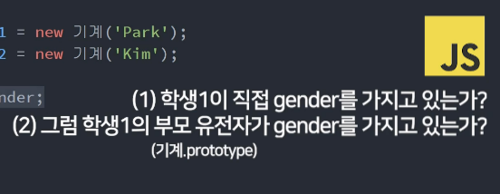

# apple_JS_ES6
> 매우쉽게 이해하는 JavaScript 객체지향 & ES6 신문법

<br>

***

<br>

## level1_1: 강의 듣기 전 자바스크립트 기본 문법 총정리 (복기하기)
* object 불러오기
> ['age']와 .age는 같다
```javascript
var name = {name: 'kim', age: 20}
name['age']
name.age
```

<br>

***

<br>

## level1_2: this 키워드를 알아보자 1. 함수와 Object에서 사용하면?
- **window**는 모든 전역변수, 함수, DOM을 보관하고 관리하는 전역객체(global object)
- **메소드**는 오브젝트안의 함수
- **strict mode?** 최상단에 'use strict' (E10 ↑)를 쓰면 JS를 엄격하게 제어

<br>

### 1. 그냥 쓰거나 함수 안에서 쓰면 this는 window를 뜻한다
- 그냥 쓸 때
```javascript
console.log(this) //window{} 
```

<br>

- 함수 안에서 쓸 때
```javascript
function 간지나는함수(){
console.log(this)
}

간지나는함수(); //window{}
```

<br>

### 1-2. strict mode일 때 함수 안에서 쓰면 this는 undefined
- strict mode에선 var 키워드 없이 변수를 선언하거나, 변수를 arguments라는 이상한 키워드로 선언하거나 그런 실수를 방지해줌

<br>

### 2. object에 있는 함수안의 this는 그 메소드의 주인을 뜻함
```javascript
var 오브젝트1 = {
  data : 'Kim',
  간지함수 : function(){ console.log(this) } 
}

오브젝트1.간지함수(); //{ data : 'Kim', 간지함수 : f } 
```

<br>

### 결론
- 메소드안의 this는 메소드의 주인 오브젝트를 뜻한다 
- 일반함수는 window라는 오브젝트에 자동으로 추가가 되기 때문에 this는 일반함수의 주인 오브젝트인 window를 뜻함 
- 오브젝트1 > 오브젝트2의 this는 오브젝트1
- 오브젝트1 > 오브젝트2 > 오브젝트3의 this는 오브젝트2

<br>

***

<br>

## level1_3: this 키워드를 알아보자 2. event listener와 constructor
- **constructor문법?** 오브젝트를 비슷한걸 여러개 만들고 싶을 경우에 사용
- **instance**는 constructor에서 새로 생성된 오브젝트를 뜻함
- 일반 함수문법에서 메소드안의 콜백함수의 this는 window를 뜻함
- arrow문법에서는 위에 있는 this값을 물려받음

<br>

### 3. constructor안의 this는 새로생성되는 오브젝트를 뜻한다
```javascript
function 기계(){
    this.이름 = 'Kim';
    this.나이 = 20;
}

// 꺼낼 땐?
var 오브젝트 = new 기계();
console.log(오브젝트)
```

<br>

### 4. eventlistener안의 this는 e.currentTarget이라는 의미
```javascript
document.getElementById('btn').addEventListener('click', function(e){
    console.log(this) //<button id="btn">버튼</button>
    console.log(e.currentTarget) //<button id="btn">버튼</button>
});
```

<br>

### case1. 이벤트리스너 안에서 콜백함수를 쓴다면 this는 window
```javascript
document.getElementById('btn').addEventListener('click', function(e){
    [1,2,3].forEach(function(){
    console.log(this) //window{}
  });
});
```

<br>

### case2. 오브젝트 안에서 콜백함수를 쓴다면 this는 window
- *이것 좀 헷갈림*
- forEach에 앞의 요소는 object가 아니다

<br>

```javascript
var 오브젝트 = {
  이름들 : ['김', '이', '박'];
  함수 : function(){
      오브젝트.이름들.forEach(function(){
        console.log(this) //window{}
      });
  }
}
```

<br>

### case3. arrow function 문법과 this
> arrow에서는 위에 있는 this값을 물려받음

<br>

1. 기존 function
```javascript
var 오브젝트 = {
  이름들 : ['김', '이', '박'];
  함수 : function(){
      console.log(this) //오브젝트
      오브젝트.이름들.forEach(function(){
        console.log(this) //window{}
      });
  }
}
```

<br>

2. arrow function
```javascript
var 오브젝트 = {
  이름들 : ['김', '이', '박'];
  함수 : function(){
      console.log(this) //오브젝트
      오브젝트.이름들.forEach(() => {
        console.log(this) //오브젝트
      });
  }
}
```

<br>

***

<br>

## level1_4: Arrow function은 function을 대체하는 신문법이 아님
-


### arrow function 기본문법
```javascript
// 기존문법
var 예쁜함수 = function(){}

// arrow문법
var 예쁜함수 = () => {}
```

<br>

### 장점? 함수 본연의 기능을 잘 표현해줌
- 함수만드는 이유는 기능으로 묶고 싶을 떼,입출력기계를 만들고 싶을때 등
- arrow는 함수 본연의 입출력기능을 아주 직관적으로 잘 표현해줌
- 입출력기능? 소괄호에 뭔가 집어넣으면 return을 이용해 뭔가 뱉어내는 것

```javascript
// 기존문법
var 더하기 = function(x){ return x + 2 }

// arrow문법
var 더하기 = (x) => { return x + 2}
```

<br>

-파라미터 1개면 소괄호 생략가능
```javascript
var 더하기 = x => { return x + 2}
```

<br>

-코드 1줄이면 중왈호도 생략가능
```javascript
var 더하기 = x => return x + 2
```
> 원래 {} 중괄호 끝날 땐 세미콜론 안쳐도 잘 되는데 생략할 땐 매너있게 세미콜론 적자  

<br>

### arrow의 this는 밖에 있던 this값을 그대로 사용
- 이벤트리스너에 this값은 window를 뜻함, e.currentTarget을 뜻하지 X

<br>

- object안의 arrow함수에서 this는 window 
```javascript
// 기존문법
var 오브젝트1 = {
  함수 : function(){ console.log(this) }
}
오브젝트1.함수() //오브젝트1


// arrow문법
var 오브젝트1 = {
  함수 : () => { console.log(this) }
}
오브젝트1.함수() //window{}
```

<br>

### 결론
arrow문법은..
- eventListener에서 this는 window
- 오브젝트안의 함수에서 this는 window
- arrow의 this는 위에 있는 this값을 물려받음

<br>

***

<br>

## level1_5: this & arrow function 연습문제 3개
### Q1. 메소드와 형제 요소로 자료출력
```javascript
var 사람 = {
    name: '손흥민',
    sayHi: (a) => {
        return `안녕 나는 ${a}`
    }
}
console.log(사람.sayHi(사람.name));
```

<br>

### Q2. 메소드로 형제 요소 모두 더하기
- 자료.data: 메소드에서 형제 자료를 가져다 쓸 때는 오브젝트명을 명시해야함 
```javascript
var 자료 = {
    data: [1, 2, 3, 4, 5],
    전부더하기: () => {
        let sum = 0;
        자료.data.forEach((a) => {
            sum += a
        })
        return sum;
    }
}
console.log(자료.전부더하기());
```

<br>

### Q3. 버튼 안의 글자 1초후에 출력하기
- 기존문법: 이벤트리스너안의 콜백함수에서 this는 window를 뜻함
- arrow문법: 이벤트리스너안의 콜백함수에서 this는 밖에 있는 this값을 물려받음

<br>

```javascript
document.getElementById('버튼').addEventListener('click', function() {
    console.log(this)
    setTimeout(() => { //기존문법 this쓰면 오류
        console.log(this.innerHTML)
    }, 2000)
});
```

<br>

***

<br>

## level1_6: 변수 신문법 총정리 1. var let const와 선언,할당,범위
- var 재선언O, 재할당O, 범위 function
- let 재선언O, 재할당X, 범위 {}
- const 재선언X, 재할당X, 범위 {}
- const로 오브젝트값 변경하는 건 에러X (할당이 아님)
- 대신 Object.freeze 쓰면 변경 못하는 오브젝트 만들 수 있음

<br>

### 재선언
```javascript
var 이름 = 'Kim'
var 이름 = 'Park'
```

<br>

### 재할당
```javascript
var 이름 = 'Kim'
이름 = 'P
ark'
```

<br>

### 범위
```javascript
function 함수() {
    var 이름1 = 'kim' //var는 function  
}
```

<br>

***

<br>

## level1_7: 변수 신문법 총정리 2. Hoisting, 전역변수, 참조

<br>

### Hoisting
- 변수의 선언을 맨위로 끌고오는 현상
- 함수도 호이스팅 현상이 일어남

```javascript
// 자바스크립트 입장에서는 
// var 나이가 이미 선언된 상태

console.log(나이); //undefined (선언은 됐지만 할당은 안된 상태)

var 나이 = 30;

console.log(나이); // 30
```

<br>

### 전역변수
- 제일 바깥에 선언한, 모든 곳에서 쓸 수 있는 변수
- window로 전역변수를 만들 수도 있음 (window.이름 = '김') ==> better👍
- 지역변수? 함수 안에 선언한 변수

<br>

### 연습문제
```javascript
if(true) {
    let a = 1;
    var b = 2;

    if (true) {
        let b = 3;
    }

    console.log(b); // 2
    // let범위는 {}니까 3이 아님
}
```

<br>

***

<br>

## level1_8: 변수 연습문제

<br>

### 1. let은 호이스팅되지만 undefined을 할당해주지 않는다 (initialization)
- 그래서 엄격하게 쓸 수있는 let, const를 사용하는 것임
```javascript
테스트(); // 함수 호이스팅 때문에 출력가능
function 테스트() {
    console.log(안녕)
    var 안녕1 = 'Hello!' // undefined
    let 안녕2 = 'Hello!' // 에러 
}
```

<br>

### 2. 변수에 할당하는 방법으로 함수를 만들면 변수 선언만 호이스팅 된다.
- 때문에 함수()는 변수에 소괄호를 붙인 형식으로 에러가 남
```javascript
함수();
var 함수 = function() {
  console.log(안녕);
  var 안녕 = 'Hello!';
} 
```

<br>

### 3. let은 호이스팅되지만 undefined을 할당해주지 않는다 (initialization)
```javascript
```

<br>

### 2. let은 호이스팅되지만 undefined을 할당해주지 않는다 (initialization)
```javascript
```

<br>

***

<br>

## level1_9: 자바스크립트가 문자 다루는 신기한 방법 (Template literals)

### backtick(backquote)의 장점
- 엔터키 가능
- 중간에 ${변수} 넣기 쉬움
- 함수와 같이 사용 (tagged literal)

<br>

### tagged literal
- 백틱 문장의 문자는 array로 만들어주고, 변수는 그대로 출력해줌
- 파라미터1: array 문자
- 파라미터2,3: 변수1, 변수2

```javascript
var 변수 = '손흥민';
function 해체분석기(문자들, 변수들) {
    console.log(문자들)
    console.log(변수들)
}
해체분석기`안녕하세요 ${변수} 입니다` 
//['안녕하세요', '입니다'] 
//손흥민
```

<br>

- 글자의 순서를 변경
```javascript
var 변수 = '손흥민';
function 해체분석기(문자들, 변수들) {
    console.log(문자들[1] + 변수들 +문자들[0])
}
해체분석기`안녕하세요 ${변수} 입니다` 
//입니다 손흥민 안녕하세요
```

<br>

***

<br>

## level1_10: 모든 괄호를 없애주는 Spread Operator 활용방법 1

<br>

### 중괄호 or 대괄호 제거
```javascript
var 어레이 = ['hello', 'world'];
console.log(어레이); // (2)['hello', 'world']
console.log(...어레이); // 'hello', 'world'
```

### 문자 하나씩 펼쳐줌
```javascript
var 문자 = 'hello';
console.log(문자); // 'hello'
console.log(문자[0]); // h
console.log(...문자); // h, e, l, l, o
```

<br>

### 사용1. Array 합치기/복사
- Array 합치기
```javascript
var a = [1,2,3];
var b = [4,5];
var c = [...a, ...b]; // [1, 2, 3, 4, 5]
```

<br>

- Array 복사
- Array 복사할 땐 **값 공유**를 방지하기 위해 Spread를 사용해야함
```javascript
var a = [1,2,3];
var b = a; ❌

a[3] = 4;

console.log(a); // [1, 2, 3, 4]
console.log(b); // [1, 2, 3, 4]
```

<br>

```javascript
var a = [1,2,3];
var b = [...a]; ⭕

a[3] = 4;

console.log(a); // [1, 2, 3, 4]
console.log(b); // [1, 2, 3]
```

<br>

### 사용2. Object 합치기/복사
```javascript
var o1 = { a : 1, b : 2 };
var o2 = { c : 3, ...o1 };
console.log(o2); // {c:3, a:1, b:2}
```

<br>

### 오브젝트의 key값 중복이 발생하면 어떻게될까요?
- key값이 중복이 일어나면 뒤에 오는 key값이 적용됨
```javascript
var o1 = { a : 1, b : 2};
var o2 = { a : 3, ...o1 };
console.log(o2); // {a:1, b:2}
```

<br>

> spread 연산자는 함수소괄호, 오브젝트 중괄호내, 어레이 대괄호내에서 보통 사용

<br>

***

<br>

## level1_11: Spread Operator 활용방법 2 & apply, call 함수 알아보기

<br>

### 사용3. 함수 파라미터 넣을 때 
- 파라미터를 하나하나 더하는 함수에 array를 넣고 싶을 때
```javascript
function 더하기(a,b,c){
   console.log(a + b + c)
}
var 어레이 = [10, 20, 30];

더하기(어레이[0], 어레이[1], 어레이[2]); //주먹구구
더하기(...어레이); //Spread쓰면 간단

더하기.apply(undefined, 어레이);  //옛날방식
```

<br>

### apply
- 어떤 함수를 오브젝트에 적용해서 실행하고 싶을 때
- 이 함수를 실행하는데.. 저기 오브젝트에다가 적용해서 실행해주세요~ 
```javascript
var person = {
    인사 : function(){
      console.log(this.name + '안녕')
    }
}
  
var person2 = {
    name : '손흥민'
}

person.인사.apply(person2); // 안녕 손흥민
// person.인사()라는 함수를 쓰는데 person2라는 오브젝트에 적용해서 실행해라~ 
```

<br>

### call (apply와 차이점)
- person.인사()에 파라미터를 넣어서 실행하고 싶은 경우
- apply는 파라미터를 [array]로 한꺼번에 집어넣을 수 있고
- call은 그냥 1,2,3 이렇게 일반 함수처럼 만 집어넣을 수 있습니다. 
```javascript
person.인사.apply(person2, [1,2,3]);
person.인사.call(person2, 1,2,3);
```

<br>

***

<br>

## level2_1: 자바스크립트 함수 업그레이드하기 (default parameter/arguments)

<br>

### default parameter
- 파라미터b에 아무 것도 안들어가면 ~넣어주세요
- 연산, 함수 다 가능
```javascript
// default에 넣을 함수
function 임시함수() {
    return 10
}
임시함수();

// 파라미터b에 아무 것도 안들어가면 '임시함수' 넣어주세요
function 더하기(a, b = 임시함수()) {
    console.log(a + b)
}
더하기(1);  // 11
```

<br>

### arguments
- 모든 파라미터를 한꺼번에 다루고 싶을 때
- 모든 파라미터를 []안에 넣은 변수
```javascript
function 함수(a, b, c) {
    console.log(arguments[0])
    console.log(arguments[1])
    console.log(arguments[2])
}

함수(1, 2, 3); // 1, 2, 3
```

<br>

- 만약 파라미터 개수가 많다면?
```javascript
// 입력한 파라미터를 전부 콘솔창에 출력해주는 함수
function 함수(a, b, c, d, e, f) {
    // 파라미터 개수만큼 반복문을 돌려줘
    for (let i = 0; i < arguments.length; i++) {
        console.log(arguments[i])
    }
}

함수(2, 3, 4) // 2, 3, 4
```

<br>

***

<br>

## level2_2: 함수에서 쓰는 점3개 Rest 파라미터를 알아봅시다

<br>

### rest 파라미터?
- 파라미터앞에 ...을 붙이면 모든 파라미터를 []에 보관해줌
- ...자리에 오는 파라미터를 []에 담아줌
(*arguments는 모든 파라미터를 []에 담아줌*)
- 파라미터를 좀 더 유연하게 다룰 수 있음
```javascript
function 함수1(a, b, ...파라미터들) {
    console.log(파라미터들)
}

함수1(1, 2, 3, 4, 5) // [3, 4, 5]
```

<br>


### rest 파라미터 예시
```javascript
// 모든 파라미터를 하나씩 콘솔창에 출력해주는 함수
function 함수2(...rest) {
    // ...rest의 개수만큼 반복문을 돌려줘
    for(let i = 0; i < rest.length; i++) {
        console.log(rest[i])
    }
}
함수2(1, 2, 3, 4) // 1, 2, 3, 4
```

<br>

### rest 파라미터 주의점
- 가장 마지막에 입력
- 1번만 사용

<br>

### 글자수세기 함수 😱어렵❗
```javascript
function 글자세기(글) {
    var 결과 = {};

    // seperate로 'a', 'b' 한글자씩 나눈 어레이를 파라미터로 받아와서 반복문
    [...글].forEach(function (a) {
        // {결과}안의 어떤 글자가 0이상이면
        if (결과[a] > 0) {
            결과[a]++
        } else {
            결과[a] = 1
        }
    });
    console.log(결과)
}

글자세기('가나가나가')
```

<br>

***

<br>

## level2_3: 이상한 Reference data type과 더 이상한 예제 3개

<br>

### primitive data & reference data
- primitive: 자료 자체가 그대로 변수에 저장된 자료형 (문자, 숫자..)
- reference: 화살표(레퍼런스)를 메모리에 따로 저장한 자료형
```javascript
var 변수 = 1234; // primitive data
var 어레이 = [1, 2, 3] // reference data
```

<br>

### primitive 복사하기
```javascript
var 이름1 = '김';
var 이름2 = 이름1;
이름1 = '박'

console.log(이름1); // '김'
console.log(이름2); // '박'
```

<br>

### reference 복사하기


- 원본을 그대로 복사한 arr/obj는 원본을 수정하면 똑같이 수정됨 (*레퍼런스가 수정되었기 때문*)
- 때문에 **그대로 복사해서 쓰면 안됨**

```javascript
var 이름1 = { name: '김' };
var 이름2 = 이름1; // ❌ 그대로 복사
이름1.name = '박';

console.log(이름1) // {name: '박'}
console.log(이름2) // {name: '박'} 
// 원본을 수정해도 복사본이 같이 수정됨
```

<br>

- 각각 다른 화살표가 저장되었기 때문에 false
```javascript
var 이름1 = { name: '김' };
var 이름2 = { name: '김' };

console.log(이름1 == 이름2); //false
```

<br>

- 파라미터는 변수와 같다
- 때문에 파라미터 = {} 해도 이름1 오브젝트는 변화가 없다
- 파라미터라는 변수에 레퍼런스를 설정한 것이지 이름1과는 무관하다

```javascript
function 변경(obj) {
  obj.name = 'Park';
}
변경(이름1) // {name: 'Park'}


function 변경(obj) {
  obj = { name: 'Park'; } //obj라는 '변수'에 레퍼런스 설정
}
변경(이름1) // 실행이X
// 사실 변경(var obj == 이름)과 같은 명령
```

<br>

***

<br>

## level2_4: 객체지향1. Object 생성기계인 constructor를 만들어 써보자
- 비슷한 obj를 여러개 복사하고 싶을 때
- 관습적으로 대문자로 작명 (ex: Student)
- **instance?** this.name = 'kim'

<br>

### 1-1. 기계 생성
```javascript
function Student기계1() {
    this.name = 'kim'; // 새로 생성되는 obj에 값 부여
    this.age = 15;

    // 기계에 함수추가
    this.sayHi = function () {
        console.log('안녕하세요' + this.name + '입니다')
    }
}
```

<br>

### 1-2. 기계로 obj 뽑기
```javascript
var 학생1 = new Student기계1();
var 학생2 = new Student기계1();

console.log(학생1) // Student기계1 {name: 'kim', age: 15, sayHi: ƒ}
console.log(학생2) // Student기계1 {name: 'kim', age: 15, sayHi: ƒ

// 기계의 함수 뽑기
학생1.sayHi(); // 안녕하세요Kim입니다
```

<br>

### 2-1. 파라미터 사용해서 가변 기계 생성
```javascript
function Student기계2(이름, 나이) {
    this.name = 이름; // 파라미터로 가변적인 변수 생성
    this.age = 나이

    this.sayHi = function () {
        console.log('안녕하세요' + this.name + '입니다')
    }
}
```

<br>

### 2-2. 가변기계에서 서로 다른 자료를 가진 obj만들기
```javascript
// 파라미터 사용해서 서로 다른 자료의 obj만들기
var 학생3 = new Student기계2('Lee', 18);

console.log(학생3) // Student기계2 {name: 'Lee', age: 18, sayHi: ƒ}
학생3.sayHi(); // 안녕하세요Lee입니다
```

<br>

***

<br>

## level2_5: 객체지향2. 이거 보고 prototype 이해 못하면 강의 접습니다
- **상속**  변수로 constructor가 가지고 있는 자료들로 obj를 만들 수 있잖아, 이런 과정을 '상속'받는다고 표현함 (부모 & 자식 관계)
- **prototype** 상속을 구현할 수 있는 또 하나의 문법

<br>

### JS는 오브젝트에서 값을 출력할 때 이런 순서로 물어본다.
1. 학생1에 직접 gender라는 값이 있는가?
2. 그럼 부모 유전자에 gender라는 값이 있는?
3. 그럼 부모의 부모 유전자에 gender라는 값이 있는가?
4. 그럼 부모의 부모의 부모의 유전자에 .. 그게 있는가?

<br>

### 유전자 생성
- prototype에 값을 추가하면 모든 자식들이 상속 받을 수 있다
- JS에 유전자를 사용하는 과정


```javascript
// 기계를 만들면 prototype이라는 공간이 자동으로 생성됨
function 기계() {
    this.name = 'Kim';
    this.age = 15;
}

// prototype에 값을 추가하면 모든 자식들이 물려받기가 가능함
기계.prototype.gender = '남' // key값 추가

var 학생1 = new 기계();
// 값을 물려받았기 때문에 '남'이 출력됨
console.log(학생1.gender); // 남
```

<br>

### prototype의 원리
```javascript
학생1.toString(); 
```
- obj와 arr에 붙일 수 있는 내장함수들.. 왜 쓸 수 있는걸까?
- 학생1엔 toString이라는 자료가 없는데!?

<br>

- JS가 arr를 만드는 방식
- arr 자료형을 만들면 자동으로 Array라는 부모(기계)가 가지고 있는 값들을 상속받을 수 있다
```javascript
// 우리 관점
var arr = [1, 2, 3]; // arr자료는 Array 유전자를 상속받을 수 있음

// JS 관점
var arr = new Array(1, 2); 

// 쓸 수 있는 내장함수들
Array.prototype // [constructor: ƒ, concat: ƒ, copyWithin: ƒ,..
```

<br>

#### object도 동일
```javascript
// 우리 관점
var obj = { kim: 'kim' }; 

// JS 관점
var obj = new Object();

// 쓸 수 있는 내장함수들
Object.prototype
```

<br>

#### 그럼 prototype으로 상속시키는거랑 constructor로 상속시키는거랑 차이가 뭐죠?
- 자식들이 값을 직접 소유하게 만들고 싶으면 constructor로 상속시키자
- 부모만 가지고 있고 그걸 참조해서 쓰게 만들고 싶으면 prototype으로 상속시키자
- 보통은 상속할 수 있는 함수 같은 것들은 prototype으로 많이 만들어놓는다

<br>

***

<br>

## level2_6: 객체지향3. prototype의 특징 몇가지
- prototype은 **함수에서만** 생성됨
- 일반 obj, arr엔 prototype이 없음
> 일반 obj를 상속 하고 싶다면? constructor, Object.create(), class

<br>

### 내 부모님 유전자를 찾고 싶다면 __proto__
- 해당 요소의 부모(유전자 요소)를 알고 싶다면__proto__
- __proto__는 부모의 prototype를 의미함
```javascript
function 기계(){
  this.name = 'Kim';
  this.age = 15;
}
var 학생1 = new 기계();

학생1.__proto__; // {gender: '남', constructor: ƒ}
기계.prototype; // {gender: '남', constructor: ƒ} 
```

<br>

### __proto__를 직접 등록하면 object끼리 상속기능을 구현 가능
```javascript
var 부모 = { name : 'Kim' };
var 자식 = {};

// 자식의 __proto__에 부모를 집어넣기
자식.__proto__ = 부모;
console.log(자식.name); // kim
```

<br>

### 콘솔창에는 prototype 정보들이 항상 출력
- 오브젝트 학생1 출력하면__proto__ 가 뜸
- 여기서 부모인 기계.prototype의__proto__도 조회가능
- 이렇게 쭉 부모의 부모까지~~ 계속 탐색 가능

<br>

#### 결론
- 모든 object 자료형의 조상은 `Object()` 라는 기계이며 (일명 Object.prototype)
- 모든 array 자료형의 조상도 `Object()`
- 모든 함수 자료형의 조상도 `Object()`
> 그래서 자바스크립트는 모든게 다 Object라고 말하는 것이다

<br>

***

<br>

## level2_7: ES5방식으로 쉽게 구현하는 상속기능
```javascript
Object.create(물려받을 부모 obj);
```

<br>

```javascript
var 부모 = {
    name: 'kim',
    age: 50
};

// 자식에게 부모의 프로토타입을 물려줄게
var 자식 = Object.create(부모);

console.log(자식)
// 값이 아닌 프로토타입을 물려받은거라 출력해도 아무것도 안뜸
console.log(자식.name)
// 내가 name을 갖고있나? (X) => 부모가 갖고있나? (O)

자식.age = 20; // 실제값을 부여
console.log(자식) // {age: 20}
```

<br>

***

<br>

## level2_8: ES6방식으로 안쉽게 구현하는 상속기능 (class)
- ES6 버전의 constructor 만드는 기능
- 객체지향 문법의 기초적인 문법 class
- 객체지향 문법은 왜쓰냐면? `object 여러개 만들어 쓰기 위해`

<br>

### class 기본문법
```javascript
class 부모1 {
    constructor() {
        this.name = 'Kim';
    }
}

// obj만들고 뽑기
var 자식 = new 부모1();
console.log(자식) // 부모 {name: 'Kim'}
```

<br>

### class에 함수를 추가하고 싶으면?
- 방법1: 자식이 직접 함수를 가짐
- 방법2: 부모의 prototype에 추가됨
    > 모든 자식들이 공용으로 쓸 수 있음

```javascript
class 부모2 {
    constructor() {
        this.name = 'Kim';
        // 방법1
        this.sayHi1 = function() { console.log('hello') }
    }
    // 방법2
    sayHi2() {
        console.log('hello')
    }
}
```

<br>

- 부모 유전자 출력하기👉 &nbsp; `.prototype`
- 자식으로 부모 유전자 출력하기1👉 &nbsp;`__proto__`
- 자식으로 부모 유전자 출력하기2👉 &nbsp;`Object.getPrototypeOf()`

```javascript
var 자식2 = new 부모2();

// 부모 유전자 확인
부모2.prototype

// 자식의 부모 유전자 확인1
자식2.__proto__

// 자식의 부모 유전자 확인2
Object.getPrototypeOf(자식2)
```

<br>

### 프로토타입 추가
- 함수 만드는 방법2에 직접 추가하거나
- 밖에서 prototype으로 만들기

```javascript
부모2.prototype.sayHello = function(){}
```

<br>

***

<br>

## level2_9: 객체지향5. class를 복사하는 extends / super
- **extends**: class 복사하기(=상속하기)
    > class안에 값이 많아지면 힘드니까 extends로 복사해서 쓰기!

<br>

### extend문법
- 할아버지라는 부모 class가 있고
```javascript
class 할아버지{
    constructor(name) {
        this.성 = 'Kim';
        this.이름 = name;
    }
    sayHi() {
        console.log('안녕 저는 할아버지에요')
    }
}

var 할아버지1 = new 할아버지('만덕');
```

#### 할아버지가 가진 특성을 물려받아 아버지 class만들기
- extends로 만든 class는 this를 그냥 쓰면 X 👉 `super()`
- 파라미터는 super()안에 👉 `super(name)`
```javascript
class 아버지 extends 할아버지 {
    constructor(name) {
        super(name);

        this.나이 = 50;
    }
}
var 아버지1 = new 아버지('만수');
console.log(아버지1) // 아버지 {성: 'Kim', 이름: '만수', 나이: 50}
```

<br>

### super의 다른 용도
- 할아버지 함수를 갖다 쓰려면 👉 `super.sayHi()`
- 는 곧 이것과 같은말 👉 할아버지.prototype.sayHi()
```javascript
class 할아버지{
    constructor(name) {
        this.성 = 'Kim';
        this.이름 = name;
    }
    // 할아버지에 함수 생성
    sayHi() {
        console.log('안녕 저는 할아버지에요')
    }
}


class 아버지 extends 할아버지 {
    constructor(name) {
        super(name);

        this.나이 = 50;
    }
    sayHi() {
        console.log('안녕 저는 아버지에요')

        // 할아버지 함수 갖다 쓰기
        super.sayHi(); // 안녕 저는 할아버지에요
    }
}
```

<br>

***

<br>

## level2_10: getter, setter 대체 왜 쓰는지 알아보기
- obj 자료를 꺼내오려면? `사람.age` ⛔
- 요즘은 자료 꺼내는 함수를 미리 만들어 씀 👉 `사람.nextAge1()`
- 장점? obj 자료가 복잡할 때, 수정할 때 좋음

<br>

### getter, setter
- 지저분한 소괄호를 쓰기 싫다면 **getter, setter**
- 무결점 함수를 만들기 위해서 **getter, setter**
- getter: 데이터 `꺼내쓰는` 함수에 붙이기
    > 꼭 return이 있어야함 *(파라미터 입력X)*
- setter: 데이터 `변경하는` 함수에 붙이기
    > 꼭 파라미터 1개가 있어야함

```javascript
var 사람 = {
    name: 'Park',
    age: 30,
    // age를 꺼내쓰는 함수
    get nextAge1() {
        return this.age + 1
    },
    // age 변경하는 함수
    set setAge1(나이) {
        // 수정 시 숫자를 문자로 입력하는 실수 등을 방지할 수 있음
        this.age = parseInt(나이);
    }
}
```

<br>

#### getter, setter 꺼내오기
- 소괄호없이 뽑고, 수정하기 가능
- set을 쓰면 직관적으로 수정할 수 있음

```javascript
// getter
사람.nextAge1;

//// setter
// 사람.setAge1(20) ❌
사람.setAge1 = '20';
```

<br>

### class에서 사용하는 getter, setter
```javascript
class person {
    constructor() {
        this.name = 'Park';
        this.age = 20;
    }
    // get
    get nextAge2() {
        return this.age + 1;
    }
    // set
    set setAge2(나이) {
        this.age = parseInt(나이);
    }
}

var 사람1 = new person();
사람1.nextAge2;
사람1.setAge2 = 20;
```

<br>

***

<br>

## level2_11: class, extends, getter, setter 연습문제 5개
### 직접 class 구조 만들어보기
- class를 만들어 강아지 오브젝트들을 뽑고 싶다면?
```javascript
var 강아지1 = { type : '말티즈', color : 'white' };
var 강아지2 = { type : '진돗개', color : 'brown' }; 
```

<br>

- 내 답안
```javascript
// class 만들기
class 강아지만들기 {
    constructor(종류, 색상) {
        this.type = 종류;
        this.color = 색상;
    }
}

// class로 obj 만들기
var 강아지1 = new 강아지만들기('말티즈', 'white');
var 강아지2 = new 강아지만들기('진돗개', 'brown');

// 확인
console.log(강아지1);
console.log(강아지2);
```

<br>

### 이번엔 고양이관련 object들을 만들고 싶습니다. 
- 고양이엔 age라는 속성을 하나 더 추가하고 싶습니다. 어떻게 class를 만들면 될까요? (type, color는 강아지 object와 유사)

<br>

- 내 답안
```javascript
class 고양이만들기 extends 강아지만들기 {
    constructor(종류, 색상, 나이) {
        super(종류, 색상);

        this.age = 나이;
    }
}

var 고양이1 = new 고양이만들기('러시안블루', 'grey', 4)
console.log(고양이1);
```

<br>

### 고양이와 강아지 object들에 기능을 하나 추가하고 싶습니다. 
- 모든 고양이와 강아지 object들은 .한살먹기() 라는 함수를 사용할 수 있습니다. 

    1️⃣ 한살먹기 함수는 강아지 class로부터 생성된 오브젝트가 사용하면 콘솔창에 에러를 출력해주어야합니다. 

    2️⃣ 한살먹기 함수는 고양이 class로 부터 생성된 오브젝트가 사용하면 현재 가지고있는 age 속성에 1을 더해주는 기능을 실행해야합니다.

한살먹기 함수는 어떻게 만들면 좋을까요? 

<br>

- 내 답안
```javascript
class 강아지만들기 {
    constructor(종류, 색상) {
        this.type = 종류;
        this.color = 색상;
    }

    // 강아지 함수 만들기
    한살먹기() {
        console.log('에러')
    }
}

class 고양이만들기 extends 강아지만들기 {
    constructor(종류, 색상, 나이) {
        super(종류, 색상);

        this.age = 나이;
    }
    // 고양이 함수 만들기
    한살먹기() {
        return this.age + 1;

        // 강아지 함수 갖다 쓰기
        super.한살먹기();
    }
}

// 확인
console.log(고양이1.한살먹기()); //5
강아지1.한살먹기(); //에러
```

<br>

- 선생님 답안
    - 에러가 '에러'가 아니고 리얼 에러라는 거ㅋㅋㅋ
    - class a가 b로 부터 생성된 오브젝트인지 아닌지 true/false로 알려주는 연산자 **instanceof**
``` javascript
class 강아지만들기 {
    constructor(종류, 색상) {
        this.type = 종류;
        this.color = 색상;
    }

    // 고양이, 강아지 둘다 사용하는 함수 만들기
    한살먹기() {
        // 고양이 instance만 실행하도록
        if (this instanceof 고양이만들기) {
            this.age++
        }
    }
}

class 고양이만들기 extends 강아지만들기 {
    constructor(종류, 색상, 나이) {
        super(종류, 색상);
        this.age = 나이;
    }
}

var 고양이 = new 고양이만들기('러시안블루', 'grey', 4);
var 강아지 = new 강아지만들기('진돗개', 'brown', 4);
고양이.한살먹기()
강아지.한살먹기()
console.log(고양이) // age: 5
console.log(강아지) // 실행X
```

<br>

### 4. get/set을 이용해봅시다
- class 이름은 unit
    1️⃣ 기본 속성: 공격력5, 체력100
    2️⃣ 전투력측정해주는 getter 함수 (공격력+체력)
    3️⃣ 체력 속성이 50 증가하는 setter 함수
    > 인스턴스는 class로부터 새로생성되는 오브젝트

<br>

- 내 답안
```javascript
class unit {
    constructor() {
        this.공격력 = 5;
        this.체력 = 100;
    }
    get battlePoint() {
        return this.공격력 + this.체력;
    }
    set heal(증가수) {
        this.체력 = this.체력 + 증가수;
    }
}

var 인스턴스 = new unit();

// get 확인
console.log(인스턴스.battlePoint);

// set 확인
인스턴스.heal = 50;
console.log(인스턴스);
```

<br>

### 5. get/set을 이용해봅시다2
- 다음과 같은 오브젝트가 있음
```javascript
var data = {
  odd : [],
  even : []
}
```
1️⃣ data 오브젝트안에 setter 역할 함수를 하나 만들어보십시오.
- setter 함수에 1,2,3,4 이렇게 아무 자연수나 파라미터로 입력하면 홀수는 odd, 짝수는 even 이라는 속성에 array 형태로 저장되어야합니다.   

2️⃣ data 오브젝트안에 getter 역할 함수를 하나 만들어보십시오.
- getter 함수를 사용하면 odd, even에 저장된 모든 데이터들이 숫자순으로 정렬되어 출력되어야합니다. 

> 예를 들면,
<br>
data.setter함수(1,2,3,4,5) 이렇게 입력하면 
<br>
data = { odd : [1,3,5], even : [2,4] }
<br>
이렇게 저장이 되어야합니다. 

<br>

```javascript
var data = {
    odd: [],
    even: [],
    // set
    setter함수: function(...숫자들){
        // '...숫자들'은 arr니까 forEach
        숫자들.forEach((a) => {
            if(a % 2 == 0) {
                this.even.push(a)
            } else {
                this.odd.push(a)
            }
        })
    },

    // get
    get getter함수() {
        return [...this.odd, ...this.even].sort()
    }
}

// set 확인
data.setter함수(4, 5, 1, 2)
console.log(data)

// get 확인
console.log(data.getter함수)
```

<br>

***

<br>

## level3_1: 틀린그림 찾기능력이 향상되는 Destructuring 문법
- 변수명을 바꾸려면 👉 `var { name: 이름}`
- 디폴트 파라미터는 👉 `var {name: 이름, 나이 = 30}`

<br>

### arr자료를 하나씩 담으려면?
- 모양에 맞춰 변수를 선언하면 변수를 생성할 수 있음
```javascript
var arr = [2, 3, 4];

// 이렇게 해도 되지만
var a = arr[0]
var b = arr[1]

// 모양에 맞춰 변수를 선언하면 변수를 생성할 수 있음
var [a,b,c] = [2, 3, 4]
console.log(a, b, c) // 2, 3, 4
```

<br>

- 선언과 할당이 모양이 다르다면 디폴트 파라미터 👉 `c = 10`
```javascript
var [a,b,c = 10] = [2, 3]
console.log(c) //10
```

<br>

### obj자료를 하나씩 담으려면?
- 변수명과 key명을 동일하게 써야함
```javascript
var obj = { name: 'Kim', age: 30 };

// 이렇게 해도 되지만
var name = obj.name;
var age = obj.age;

// 변수명과 key명을 동일하게 써야함
var { name, age} = { name: 'Kim', age: 30 };
```

<br>

- 디폴트 파라미터는?
```javascript
var { name, age = 30} = { name: 'Kim' };
console.log(age) // 30
```

<br>

- 변수명을 바꾸려면?
```javascript
var { name: 이름, age = 31 } = { name: 'Kim' }
console.log(이름) // Kim 
```

<br>


### 반대로 변수들을 obj에 집어넣고 싶으면
- `key명: 변수명`

```javascript
var name = 'Kim'
var age = 30

// name이라는 key에는 name의 value를
var obj = {name: name, age: age}
```

<br>

- ES6부터 축약해서 쓸 수 있게됨
> key명과 변수명이 같다면
```javascript
// var obj = {name: name, age: age}
var obj = { name, age}
```

<br>

### 함수 파라미터를 만들 떄도 사용
- obj 데이터를 파라미터로 만들고 싶다면?
```javascript
// obj의 key값을 파라미터로 사용
function 함수( {name, age} ) {
    console.log(name) // Kim
    console.log(age)  // 31
}

// key값에 value 설정
함수({ name: 'Kim', age: 30 }) // Kim, 30
```

<br>

- arr 데이터를 파라미터로 만들고 싶다면?
> 함수를 실행할 때 괄호 넣어야함❗
```javascript
function 함수( [a, b] ) {
    console.log(a);
    console.log(b);
}

// 함수를 실행할 때 괄호 넣어야함
함수([1, 2]); // 1, 2
```

<br>

### Destructuring 연습문제
1️⃣ a와 address와 number라는 변수는 각각 무슨 값을 가지고 있을까요? 
```javascript
var [number, address] = [ 30, 'seoul' ];
var {address : a , number = 20 } = { address, number };
```
- 내 답안
    - a: seoul
    - address: seoul
    - number: 30
    > number는 값이 설정이 되있어서 디폴트값이 필요없기때문!

<br>

2️⃣ 다음과 같은 Object에서 데이터를 뽑아서 변수를 만들고 싶습니다.
- 키, 몸무게, 상의사이즈, 하의사이즈 정보를 각각 뽑아서 4개의 변수를 만들고 싶습니다.
```javascript
let 신체정보 = {
  body: {
    height: 190,
    weight: 70
  },
  size: ["상의 Large", "바지 30인치"],
};
```

<br>

- 선생님 답안
> 데이터가 얼마나 복잡하든간에 `좌우 형태를 똑같이 맞추면` destructuring 문법으로 변수를 만들 수 있습니다.
```javascript
let { body: {height, weight}, size: [상의, 하의] } = 신체정보;
console.log(height) // 190
console.log(weight) // 70
console.log(상의)   // 상의 Large
console.log(하의)   // 바지 30인치
```

<br>

***

<br>

## level3_2: import / export 를 이용한 파일간 모듈식 개발
- 리액트, 뷰 사용할 때 자주 쓰는 문법
- **IE에선 안됨**, 보통은 `<script src="">` 쓰자❗

<br>

### 하나만 내보내는 export default 문법
- 파일당 `1회만` 사용할 수 있음
- import `작명은자유` from 경로

<br>

- export(library.js)
```javascript
var a = 10;

// 파일당 1회만 사용
export default a;
```

<br>

- import(index.html)
```javascript
import 임포트한것 from '/library.js';
```

<br>

### 여러개 내보내는 export {} 문법
- import 할 때 `동일한 변수명`을 써줘야함

<br>

- export(library.js)
```javascript
var a = 10;
var b = 20;
var c = 30;

// 여러개 export할 때 사용
export { b, c };
```

<br>

- import(index.html)
```javascript
import {b, c} from '/library.js';
```

<br>

### export default와 export는 동시에 사용할 수 있음
- export(library.js)
```javascript
var a = 10;
var b = 20;
var c = 30;

export default a;
export { b, c };
```

<br>

- import(index.html)
```javascript
import a, {b, c} from '/library.js';
```

<br>

### import할 변수 이름을 바꾸려면?
```javascript
import a as 변경a, {b as 변경b} from '/library.js';
```

<br>

### import할 때 변수들이 너무 많으면 *
- *로 import해온 것들은 별명을 꼭 지어줘야함
- export default한 건 *이 적용되지 X

<br>

```javascript
// *로 import해온 것들은 별명을 꼭 지어줘야함
import * as 별명 from '/library.js';

// export default한 건 *이 적용되지 X
import 디폴트한c, * as 별명 from '/library.js';
```

<br>

### 옛날 방식
```javascript

// export 하는 js파일
module.exports.a = 10 ;

------------------------

// import 하는 js파일
var 가져온거 = require('/library.js'); 

```

<br>

***

<br>

## level3_3: Stack, Queue를 이용한 웹브라우저 동작원리
```javascript
// 1빠
console.log(1+1)

// 3빠, 맨마지막에 실행
setTimeout(function(){ console.log(2+2) }, 1000)

// 2빠
console.log(3+3)
```

- 브라우저가 자바스크립트 코드를 실행시킬 때 과정
    - 동기처리: stack => 실행
    - 비동기처리: stack => 대기실 => queue => 실행

- 비동기처리가 되는 요소들
    - ajax요청, 이벤트리스너, setTimeout 등

- 주의점?
    - stack을 바쁘게 만들면 비동기처리 요소들이 실행이 불가능할 수도 있음
    
- stack을 바쁘지 않도록 하는 트릭?
    - 1. setTimeout을 이용하는 것입니다.
    - 2. Web worker를 이용합니다.

<br>

***

<br>

## level3_4: 동기/비동기처리와 콜백함수라는 용어 깔끔하게 정리
- 자바스크립트는 기본적으로 `동기식 처리`
- **동기식?** 한번에 코드 한줄씩 차례로 실행
- **비동기식?** 오래걸리는 작업이 있으면 제껴두고 다른 것 부터 처리하는 방식 (Web API 에 잠시 보관)

<br>

- 순차적으로 실행시키기 위해선 👉 콜백함수를 사용 
- 콜백함수? 함수 안에 들어가는 함수
```javascript
function 첫째함수() {
    console.log(1);
}

function 둘째함수() {
    console.log(2);
}

첫째함수();
둘째함수();
```
> 오래걸리는 것은 제껴두기 때문에 순차대로 실행되지 않을 수 있음

<br>

- 순차적으로 실행시키려면 👉 파라미터를 사용해서 순차적으로 실행되도록 할 수 있음
```javascript
function 첫째함수(구멍) {
    console.log(1);
    구멍();
}

function 둘째함수() {
    console.log(2);
}

첫째함수(둘째함수);
```
> 비동기와는 관련X => 비동기 처리는 setTimeout, addEventListener 등으로

<br>

- 순차적으로 실행시키기 위해 콜백함수를 사용하면 👉 복잡해지는 문제점 생김🚫
```javascript
첫째함수(function(){
    둘째함수(function(){
        셋째함수(function(){

        })
    })
})
```
> 순차적 실행을 더 쉽게 쓰기위한 **Promise패턴**

<br>

***

<br>

## level3_5: 인간의 언어로 설명하는 ES6 Promise
- 순차적 실행을 위해 콜백함수 대신 쓸 수 있는 Promise 
- Promise는 성공/실패를 판정하는 기계
- Promise는 동기를 비동기로 바꿔주는 마법의 문법이 아님
- **비동기와 괸련X**, 콜백함수 디자인의 대체문법임
- 콜백함수 디자인을 할 떄, 복잡해지는 코드의 문제를 해결하기 위해 씀

<br>

### Promise 기본문법
- 성공/실패 판정 Promise 디자인 하는법
- 성공 시 실행 👉 then
- 실패 시 실행 👉 catch

```javascript
var 프로미스 = new Promise(function(resolve, reject){
    resolve(); // 성공 시 실행 => then
    reject();  // 실패 시 실행 => catch
});

// 프로미스가 성공일 경우 실행할 코드
프로미스.then(function(){

}).then(function(){

}).catch(function(){ //실패할 경우 실행

}).finally(function(){ // 성공or실패든 뭔가 일어났을 때 실행

})
```

<br>

### Promise 예시1
- 파라미터를 사용해서 성공/판정할 때의 결과값을 특정코드에서 실행할 수 있음
> 파라미터 전달하는 방식에 유의❗

```javascript
var 프로미스 = new Promise(function(resolve, reject){
    // 연산이 끝나면 성공() 판정을 해주세요~
    var 어려운연산 = 1 + 1;
    resolve(어려운연산);
});

프로미스.then(function(결과){
    console.log(결과) // 2
}).catch(function(){
    console.log('실패했어요')
})
```

<br>

### Promise 예시2
- Promise 안에 10초 걸리는 어려운 연산을 시키면 10초동안 브라우저가 멈춤, 10초 걸리는 연산을 해결될 때 까지 대기실에 제껴두고 그런거 아님
> 원래 자바스크립트는 평상시엔 동기적으로 실행이 되며 비동기 실행을 지원하는 특수한 함수들 덕분에 가끔 비동기적 실행이 될 뿐

```javascript
var 프로미스 = new Promise(function(resolve, reject){
    // 1초후에 성공 판정을 해주는 Promise
    setTimeout(function(){
        성공();
    }, 1000)
});

// 성공 시 실행될 코드
프로미스.then(function(){
    console.log('성공했어요');
})
```

<br>

### Promise는 3가지 상태가 존재
- 성공하면 👉 `Promise {<resolved>}`
- 판정 대기중이면 👉 `Promise {<pending>}`
- 실패하면 👉 `Promise {<rejected>}`
> 콘솔창에 Promise를 확인하는 것만으로 판정 결과를 확인 가능

<br>

### Promise가 적용된 함수들
- jQuery.ajax().done()
- fetch().then().catch()

<br>

***

<br>

## level3_6: ES6 Promise 간단 연습문제 & 해설
### 1️⃣ 이미지 로딩 성공시 특정 코드를 실행하고 싶습니다.

- 이미지가 로드가 되면 콘솔창에 성공, 로드가 실패하면 콘솔창에 실패를 출력

```html
 
``` 

<br>

- 내 답안
```javascript
var 이미지 = document.getElementById('test');

var 프로미스 = new Promise(function(성공, 실패){
    // 이미지 로드 성공 => 성공코드 실행
    이미지.addEventListener('load', function(){
        성공();
    })
    // 이미지 로드 실패 => 실패코드 실행
    이미지.addEventListener('error', function(){
        실패();
    })
});

프로미스.then(function(){ // 성공코드
    console.log('성공');
}).catch(function(){ // 실패코드
    console.log('실패');
})
```

<br>

### 2️⃣ Ajax 요청이 성공하면 무언가 코드를 실행하고 싶습니다. 
- GET 요청을 해서 성공하면 Promise의 then 함수를 이용해서 Ajax로 받아온 인삿말을 콘솔창에 출력해주고 싶습니다.

<br>

- 내 답안
```javascript
var 프로미스 = new Promise(function (성공, 실패) {
    $.ajax({
        type: 'GET',
        url: 'https://codingapple1.github.io/hello.txt'
    }).done(function(결과) {
        성공(결과)
    })
})

프로미스.then(function(결과){
    console.log(결과)
})
```

<br>

### 3️⃣ Promise chaining 
- hello.txt GET 요청
- 그게 완료되면 hello2.txt GET 요청
- 그게 완료되면 hello2.txt 결과를 콘솔창에 출력

<br>

> 내 답안: 어려워요😭 ❗❗
#### 선생님 답안
- then을 여러개 붙여서 단계적으로 실행할 수 있음
- 그냥 붙이면 안되고 then 함수는 new Promise()로 부터 생성된 오브젝트에만 붙일 수 있음
- then을 붙일 수 있게 첫째 then에서 return new Promise() 이런걸 해주면 되지 않을까요?
> return 해주면 그 자리에 new Promise()가 남아서 거기 뒤에 .then을 붙일 수 있음

<br>

```javascript
var 프로미스 = new Promise(function(성공, 실패) {
    $.get('https://codingapple1.github.io/hello.txt')
    .done(function(결과1) {
        성공(결과1);
    })
})

프로미스.then(function(결과1){
    console.log(결과1)

    var 프로미스2 = new Promise(function(성공, 실패){
        $.get('https://codingapple1.github.io/hello2.txt')
        .done(function(결과2){
            성공(결과2);
        })
    })

    return 프로미스2;

}).then(function(결과2){
    console.log(결과2);
})
```

#### 유의점
- 💡성공하면 실행할 코드 안에서도 Promise를 생성할 수 있다는 것
- 💡then을 이어붙이기 위해서 새로운 Promise를 retrun해주었다는 것

<br>

***

<br>

## level3_7: Promise 어려워서 싫으면 async/await을사용합시다
- ES8(2018)에 나옴
- 복잡한 Promise를 더 간단하게 쓰기 위한 async + await

<br>

### async 기본문법
- async를 쓰면 함수 실행 후에 Promise 오브젝트가 남음 (그래서 then을 쓸 수 있음)
- 성공 판정만 가능함
```javascript
async function 더하기(){
    // 연산 결과를 출력하려면 return
    return 1 + 1;

    // 강제로 실패 내뱉기
    // return Promise.reject('실패임')
}

더하기().then(function(결과){
    console.log(결과) // 2
})
```

<br>

### async + await
- async 안에서 쓰는 await (then 대신 사용)
- 프로미스 해결될 떄 까지 기다렸다가 👉 `await 프로미스`
- 연산 결과를 변수에 담아줌 👉 `var 결과`

```javascript
async function 더하기(){
    var 프로미스 = new Promise(function(성공, 실패){
        var 힘든연산 = 1 + 1;
        성공();
    })


    // 프로미스 해결될 떄 까지 기다렸다가
    // 연산 결과를 변수 선언에 담아줌
    var 결과 = await 프로미스;
    console.log(결과); // 2
}
```

<br>

### 실패 시 컨트롤 하는 try, catch
- await은 프로미스 실패 시, 에러나고 멈춤
- 실패 시 멈추지 않고, 실행 시킬 코드를 쓰기위해
- `try { 이걸 해보고 에러나면 } catch { 이걸 실행해주세요 }`

```javascript
async function 더하기(){
    var 프로미스 = new Promise(function(성공, 실패){
        var 힘든연산 = 1 + 1;
        실패();
    })

    try {
        var 결과 = await 프로미스;
        console.log(결과);
    } catch {
        console.log('프로미스 연산이 잘 안됐군요')
    }
}
```

<br>

### 예시: 버튼 클릭 이 성공하면 성공 코드를 실행해주세요

<br>

#### Promise 버전
```javascript
var 버튼 = document.getElementById('btn');

var 버튼프로미스 = new Promise(function(성공, 실패){
    버튼.addEventListener('click', function(){
        성공('성공했어요');
    })
})

버튼프로미스.then(function(멘트){
    console.log(멘트)
})
```

<br>

#### async + await 버전
> async 함수를 마지막에 실행시켜줘야함❗

```javascript
async function 버튼함수() {
    var 버튼프로미스 = new Promise(function(성공, 실패){
        버튼.addEventListener('click', function(){
            성공('성공했어요');
        })
    });

    var 멘트 = await 버튼프로미스;
    console.log(멘트)
}
버튼함수();
```

<br>

***

<br>

## level3_8: for in / for of 반복문과 enumerable, iterable 속성

<br>

### 반복문의 종류
- for 반복문
- forEach 반복문 👉 `array 전용`
- for in 👉 `object 전용`
- for of 👉 `iterable 전용`

<br>

### 반복문 용도
- ☝️ 코드 여러번 실행할 때
- ✌️ arr, obj에서 자료 꺼내 쓸 때

<br>

### for in
- 오브젝트 값을 하나씩 출력하기 위해
- 오브젝트 자료 개수만큼 돈다
- 반복문이 돌 때마다 '작명'에 key값을 저장해줌

```javascript
for (var 작명 in 오브젝트1) {
    console.log(오브젝트1) // {name: 'Kim', age: 30} * 2
    console.log(오브젝트1[작명]) // Kim, 30
}
```

#### for in: enumerable(셀 수 있는 것) 한 것만 반복해줌
- enumerable이 true인 것만 반복해줌
- enumerable 판별하기 👉 `getOwnPropertyDescriptors`

```javascript
Object.getOwnPropertyDescriptors(오브젝트1, 'name');
```

<br>

#### for in: 부모의 prototype도 반복해줌
> 사실 부모 prototype까지 반복할 일이 별로 없음

```javascript
class 부모 {

}
// 부모에 유전자 생성
부모.prototype.name = 'Park';

var 오브젝트2 = new 부모();

for (var 작명 in 오브젝트2) {
    // 부모 유전자도 출력됨    
    console.log(오브젝트2[작명]) // Park
}
```

<br>

#### for in: 내가 갖고 있는 값만 반복하려면❗
- 내가 key를 직접 갖고 있냐를 검사해주는 함수 👉 `hasOwnProperty`

```javascript
class 부모 {

}
부모.prototype.name = 'Park';

var 오브젝트2 = new 부모();

for (var 작명 in 오브젝트2) {
    // 내가 직접 갖고 있는 값인지 검사
    if (오브젝트2.hasOwnProperty(작명)) {
        console.log(오브젝트2[작명])
    }
}
```

<br>

### for of
- arr, 문자, arguments, NodeList, map, set...등에 사용 가능

<br>

#### for of 사용 예시
```javascript
// 어레이 자료 개수만큼 반복
var 어레이 = [2, 3, 4, 5];

// '자료'는 어레이의 자료 하나하나를 뜻함
for (var 자료 of 어레이) {
    console.log(자료) // 2, 3, 4, 5
}
```

```javascript
// 글자도 반복몬 돌릴 수 있음
// 글자 분석도 가능
for (var 자료 of 'APPLE') {
    console.log(자료)
}
```
<br>

#### for of: iterable한 자료형에만 사용 가능
- iterable한지 알 수 있는 함수 👉 `[Symbol.iterator]` 
> Iterator가 붙으면 iterable한 자료

<br>

***

<br>

## level3_9: Symbol 자료형은 쓸모없어보이는데 왜 있는거죠
- obj자료형의 비밀스런 key값
- 비밀스런 데이터를 저장하고 싶을 때

<br>

### Symbol 만들기
- ES6부터는 key값에 문자뿐만 아니라 symbol도 넣을 수 있음

```javascript
var person = { name: 'soo', age: 30 }

// 공개적
// person.몸무게 = 100;

// 비공개적
var weight = Symbol('시크릿 몸무게')
var height = Symbol('시크릿 키')

person[weight] = 200;
person[height] = 160;
console.log(person); //{..., Symbol(내 시크릿 몸무게임): 100}
```

<br

### Symbol 만들기2
```javascript
var person = { name: 'soo', [height]: 160 }
```

<br>

### 반복문을 돌려보면 symbol은 출력이 안됨
- 반복문에서 출력되지 않는 건 enumerable 하지 않아서

```javascript
for ( var key in person ) {
    console.log(person[key]) // soo, 30
}
```

### 심볼 특징
#### 1️⃣ 설명이 같다고 같은 symbol이 아님
> 설명은 설명일 뿐

```javascript
var a = Symbol('설명');
var b = Symbol('설명');
a === b // false
```

<br>

#### 2️⃣ 전역변수 같은 전역 symbol 만들기
- 설명이 같은 symbol을 만들면 기존 심볼을 복붙해줌

```javascript
var c = Symbol.for('설명1')
var d = Symbol.for('설명1')
c === d // true
```
<br>

#### 3️⃣ 기본 내장 symbol들
- ex: Array에 내장된 기본 Symbol
```javascript
var 어레이 = [2, 3, 4]
어레이[Symbol.iterator]
```

<br>

***

<br>

## level3_10: 매우 짧게 알아보는 Map, Set 자료형
### Map
- Obj랑 비슷, key & value 함께 저장
- 자료의 연관성을 표현하기 위해 사용
- 차이점? 
    - 표현방식이 다름 👉 `{'name'=> 'Kim'}`
    - Obj는 key에 글자만 가능, Map은 다 가능

<br>

#### Map 자료 만들기
- 자료 하나씩 넣기
```javascript
var person = new Map();
person.set('name', 'Kim'); // name => Kim
person.set('age', '20'); // name => Kim

//// Map은 key에 모두 가능
person.set('100', 'Kim'); // 숫자가능
person.set([1, 2, 3], 'Kim'); // Arr가능
```

<br>

- 자료 여러개 넣기
> 대괄호 사용

```javascript
var person2 = new Map([
    person.set('100', 'Kim'),
    person.set([1, 2, 3], 'Kim')
])
```

<br>

#### Map 자료 다루기
```javascript
// Map 자료 꺼내는 법
person.get('age')

// Map 자료 삭제
person.delete('age')

// Map 자료 갯수 세기
person.size

// Map에 반복문 돌리기
for(var key of person.keys()) {
    console.log(key)
}
```

<br>

### Set
- 중복자료를 허용하지 않는 Arr

<br>

#### Set 자료 만들기
```javascript
var 출석부2 = new Set(['john', 'tom', 'tom', 'andy']);
출석부2 

// {'john', 'tom', 'andy'}
// 중복자료를 제거해줌
```

<br>

#### Set 자료 다루기
```javascript
// set에 자료 추가
출석부2.add('sally');

// set 자료 제거
출석부2.delete('sally');

// 자료 있는지 확인 (true & false)
출석부2.has('sally');

// 자료 개수 확인
출석부2.size //3
```

<br>

#### 일반 Arr => Set으로 변환하기
```javascript
// 일반 Arr
var 출석부 = ['john', 'tom', 'tom', 'andy'];

// Set으로 변환
var 출석부3 = new Set(['john', 'tom', 'tom', 'andy']);


// {'john', 'tom', 'andy'} 중괄호로 감싸져있음
// 다시 Arr로 만들고 싶으면
출석부 = [...출석부3]
```

<br>

***

<br>

## level3_11: Web Components : 커스텀 HTML 태그 만들기
- 반복되는 HTML 태그를 축약하기 위해 사용
- 브라우저 기본 기능임
- 장점? 중복제거, 코드 재활용 가능

<br>

### Web Components 만들기
1. customElements.define
- `customElements.define('태그작명', 클래스형태의 HTML)`

```javascript
customElements.define('custom-input', 클래스)
```

<br>

2. 클래스형태의 HTML 만들기
> 여기서 **this**는 커스텀태그를 뜻함

```javascript
class 클래스 extends HTMLElement {
    connectedCallback() {
        // 커스텀태그가 HTML에 입력되면 실행할 코드

        // 방법1
        this.innerHTML = `<label>${name} 인풋 이에요</label><input>`
        
        // 방법2
        let 요소 = document.createElement('label');
        this.appendChild(요소)
    }
}

customElements.define('custom-input', 클래스)
```

<br>

### <커스텀태그> 안에서도 파라미터 사용 가능
- attribute를 파라미터처럼 사용 가능

<br>

1. attribute 생성
```javascript
<custom-input name="비번"></custom-input>
<custom-input name="아이디"></custom-input>
```

<br>

2. attribute 사용하기
- 변수로 사용하기

```javascript
class 클래스 extends HTMLElement {
    connectedCallback() {
        
        // att 가져오기
        let name = this.getAttribute('name');

        // 가져온 att 사용
        this.innerHTML = `<label>${name} 인풋 이에요</label><input>`;

    }
}
```

<br>

- attribute가 변경될 때 마다 뭔가 실행되려면
```javascript
class 클래스 extends HTMLElement {
    connectedCallback() {
        // 커스텀태그 실행 코드
    }
    static get observedAttributes() {
        // name이라는 att가 변경될 때마다
        retun ['name']
    }
    attributeChangeCallback() {
        // 이 코드를 실행해주세요~
        console.log(this.getAttribute('name'))

        // HTML 재렌더링 할 수도 있음
        this.innerHTML = `<label>${name} 인풋 이에요</label><input>`
    }
}
```
> Web Components 라이브러리: Lit, Stencil 등

<br>

***

<br>

## level3_12: shadow DOM과 template으로 HTML 모듈화하기

<br>

### shadowDom이란
- shadowDom: HTML태그를 몰래 숨겨두는 기능


<br>

### shadowDom 만드는 법
1. HTML태그 생성
```html
<div id="mordor"></div>
```

<br>

2. div박스에 shadowRoot 열어주기
- `attachShadow`
> shadowRoot: HTML태그 숨겨주는 곳
```javascript
document.querySelector('#mordor').attachShadow({
    mode: 'open'
})
```

<br>

3. shadowRoot안에 숨길 태그 생성
- `shadowRoot`

```javascript
document.querySelector('#mordor').shadowRoot.innerHTML = `<p>심연에서 왔도다</p>`
```

<br>

### Web Components + shadowDom로 완벽한 HTML 모듈화하기

<br>

#### Web Components에 스타일을 주게되면..
- **문제?** 다른 label태그도 오염됨! 👉 `shadowDom`을 쓰자
- shadowDom에 넣으면 외부에 영향❌

```javascript
class 클래스 extends HTMLElement {
    connectedCallback() {
        // Web Components에 style
        this.innerHTML = `
        <label>이메일 입력하세요</label><input>
        <style></style>`


        // shadowDom으로 style
        this.attachShadow({mode: 'open'})
        this.shadowRoot.innerHTML = `<label>이메일 입력하세요</label><input>
        <style> label {color: red} </style>`
    }
}
```

<br>

#### 실무에서는...
- 위와 같이 짜면 더러움 👉 `template`을 쓰자
> template: HTML 임시 보관함

<br>

1. template 만들고, 스타일주기

```html
<template id="template1">
    <label>이메일을 입력하세여</label><input>
    <style> label { color: red } </style>
</template>
```

<br>

2. Web Components안에 template 생성하기
```javascript
class 클래스 extends HTMLElement {
    connectedCallback() {
        
        this.shadowRoot.append(template1.content.cloneNode(true))

        // 이벤트리스너 달려면?
        var el = this.shadowRoot.querySelector('label');
        el.addEventListener('click', function(){ });

    }
}
```

<br>

***

<br>

## level3_13: class로 만들어보는 간단한 2D 게임 1 (배웠으면 써먹어야하니까)

<br>

1. 화면에 네모, 원 그릴 수 있어야함
2. 프레임마다 코드실행 가능해야 (for 애니메이션)
> 1초에 60번정도
3. collion check 할 수 있어야함 (충돌 체크)


